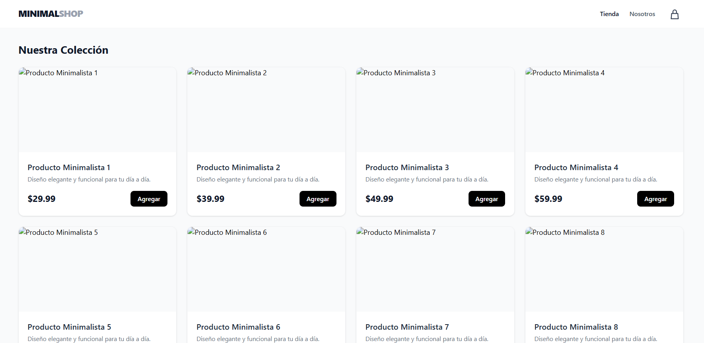

# MinimalShop Component 🛒✨

Un componente de catálogo de productos minimalista, responsivo y tipado estáticamente, construido con enfoque "Mobile-First" para una integración rápida en aplicaciones modernas.

## 📸 Vista Previa Visual


*Ejemplo visual del grid de productos renderizado en una pantalla de escritorio (lg:grid-cols-4).*

## 🛠 Tecnologías Utilizadas

* **Framework:** React (Functional Components)
* **Lenguaje:** TypeScript (Tipado estricto de interfaces)
* **Estilos:** Tailwind CSS (Utility-first, diseño responsivo)
* **Iconografía:** SVG nativo (sin dependencias externas)

## 📦 Estructura de Archivos

```text
src/
├── components/
│   ├── ProductCard.tsx    # Componente presentacional de la tarjeta
│   ├── ProductGrid.tsx    # Contenedor de layout y mapeo de datos
│   ├── types.ts           # Definición de la interfaz `Product`
│   └── data.ts            # Datos mockeados para desarrollo
└── App.tsx                # Layout principal (Header, Main, Footer)